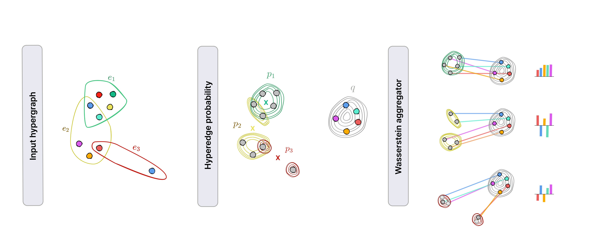

# Wasserstein Hypergraph Neural Network

This is the official code for WHNN models as introduced in [Wasserstein Hypergraph Neural Network](https://arxiv.org/abs/2506.09682)

<div align="center">
  
</div>


## Citation
Please use the following BibTeX to cite our work.
```
@misc{duta2025wassersteinhypergraphneuralnetwork,
      title={Wasserstein Hypergraph Neural Network}, 
      author={Iulia Duta and Pietro Liò},
      year={2025},
      eprint={2506.09682},
      archivePrefix={arXiv},
      primaryClass={cs.LG},
      url={https://arxiv.org/abs/2506.09682}, 
}
```

Note: The general pipeline used in this repo is based on the public repository of https://github.com/jianhao2016/AllSet and https://github.com/Graph-COM/ED-HNN. 
In implementing the poolings, we also use functions from https://github.com/mint-vu/backbone_vs_pooling/blob/main/poolings/attention.py

We would like to thank all the authors of the above papers for their work and for making the code available. 

## Enviroment requirement:
The required env is stored in: WHNN_env.yml

## Overview:
TODO
The main class of the project is models_set.SetHNN  


## How to run the model
TODO
For creating a model with Wasserstein aggregator set `--pooling_type=FPSWE` (for fixed references) or `--pooling_type=LPSWE` (for learnable references)

For creating a model with MLPnode encoder set `--proc_type=MLP`, while for the SAB/ISAB node encoder set `--proc_type=SAB` or `--proc_type=ISAB`

## Datasets
To generate datasets please follow the instructions from https://github.com/jianhao2016/AllSet and place the data folder in `../data`

## Example of script to run one experiment on Citeseer

```
CUDA_VISIBLE_DEVICES=0 python train.py --All_num_layers=1 --Classifier_hidden=256 --Classifier_num_layers=1 --MLP3_num_layers=0 --MLP_hidden=256 --MLP_num_layers=2 --add_self_loop=False --apprepset_n_anchors=5 --deepset_input_norm=True --dname=citeseer --dropout=0.7 --epochs=300 --feature_noise=1 --fpswe_out=linear --heads=4 --input_dropout=0.6 --lr=0.001 --method=SetHNN --normalization=ln --pooling_type=FPSWE_test --proc_type=SAB --runs=10 --wd=0
```


